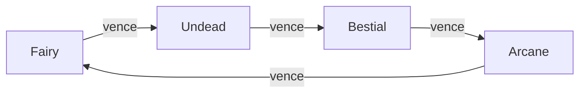
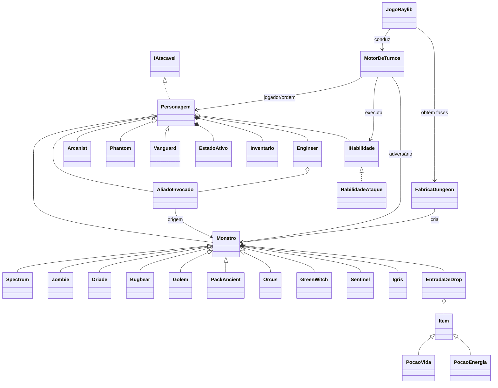

# ARISE — RPG de Batalha por Turnos

ARISE é um RPG gráfico de progressão em que o jogador escolhe uma classe, atravessa níveis de uma masmorra e enfrenta inimigos em batalhas por turnos até o confronto final com Igris. O projeto se inspira em RPGs de progressão e exploração de masmorras: vitórias concedem experiência, possíveis itens e novas habilidades. Foi desenvolvido em C# com Programação Orientada a Objetos (POO) e usa uma janela gráfica criada com Raylib-cs.

> Este documento descreve o estado do código analisado. Itens não demonstráveis por inspeção, compilação ou testes automatizados são identificados como **⚠️ Pendente de confirmação**.

## 2. Informações acadêmicas

| Campo | Informação |
|---|---|
| Disciplina | Programação Orientada a Objetos |
| Tipo | Trabalho final |
| Trilha escolhida | Trilha A — RPG de batalha por turnos |
| Linguagem | C# |
| Framework | .NET 10.0 (`net10.0`) |
| Interface | Gráfica, com Raylib-cs 8.0.0 |
| Integrantes | Maria Eduarda Teodoro |

## 3. Objetivo do jogo

O jogador deve vencer, em ordem, os dez monstros distribuídos por três níveis e um desafio final. Cada batalha é conduzida por `MotorDeTurnos`: jogador, monstro e eventual aliado agem segundo iniciativa; o jogador pode atacar, defender, usar habilidade, usar item ou fugir.

Ao vencer, o personagem recebe a XP definida pelo monstro e participa do sorteio de sua tabela de drops. A XP pode elevar o nível e aumentar atributos; ao concluir uma fase, o jogador pode aprender uma habilidade correspondente ao nível alcançado. A tela de escolha apresenta nome, dano, custo de MP e elemento de cada opção. A vitória final acontece após derrotar Igris e avançar além do último nível da lista `dungeon`. A derrota ocorre quando a vida do jogador chega a zero. Uma fuga bem-sucedida produz `ResultadoCombate.FugaJogador` e encerra toda a partida na tela `FimDeJogo`; uma tentativa malsucedida consome o turno.

## 4. Como executar o projeto

### Pré-requisitos

- SDK do .NET 10.0;
- sistema com suporte a uma janela gráfica Raylib;
- Git, apenas para clonar o repositório;
- JetBrains Rider, opcional para execução pela IDE.

### Terminal

Na raiz do repositório:

```bash
dotnet restore "ARISE.sln"
dotnet run --project ARISE/ARISE.csproj
```

Há um único `.csproj`, em `ARISE/ARISE.csproj`. Para baixar o projeto, clone o repositório com `git clone <URL-DO-REPOSITORIO>` ou extraia o arquivo fornecido e abra a pasta raiz.

### JetBrains Rider

1. Abra `ARISE.sln`.
2. Aguarde a restauração do NuGet.
3. Selecione o projeto executável `ARISE`.
4. Execute a configuração do projeto (Run).

As pastas `Imagens/`, `Fontes/` e `Musicas/` são necessárias à apresentação. O `.csproj` copia esses recursos para os diretórios de saída e publicação. As imagens PNG fornecem capa, seleção de classe e ilustrações dos monstros; as fontes TTF renderizam texto e emojis; a faixa OGG é reproduzida continuamente como música de fundo a 25% do volume. `JogoRaylib.ResolverCaminhoRecurso` procura primeiro ao lado do executável e depois no diretório corrente. Há fallback de fonte para `C:\Windows\Fonts\seguiemj.ttf`, o que cria dependência específica de Windows quando as fontes incluídas não forem encontradas.

## 5. Controles e fluxo do jogo

O fluxo gráfico é controlado por `JogoRaylib` e `EstadoJogo`: capa, nome do herói, classe, entrada na fase, aparição do monstro, eventual reanimação, combate, resultado, evolução e encerramento. Não há tela para escolher livremente uma masmorra; a progressão criada por `FabricaDungeon` é linear.

Em cada rodada, `MotorDeTurnos` recria a ordem por `Reflexo` decrescente e, no empate, `Tecnica` decrescente. O jogador seleciona uma ação quando seu turno chega; monstro e aliado agem automaticamente. Ao terminar a lista, os estados são decrementados, a rodada é incrementada e uma nova ordem é calculada. Vida zero, fuga ou morte do monstro encerram o combate.

| Contexto | Entrada | Resultado |
|---|---|---|
| Capa | `Enter` ou `Espaço` | Inicia a criação do herói |
| Nome | Texto, `Backspace`, `Enter` | Edita/confirma o nome; vazio vira `Shadow Hunter` |
| Classe | `1` Engineer; `2` Arcanist; `3` Phantom; `4` Vanguard | Cria o personagem |
| Pergunta de reanimação | `S` / `N` | Tenta reanimar o último monstro / ignora |
| Combate | `1` | Ataque básico |
| Combate | `2` | Defender e recuperar MP |
| Combate | `3` | Abrir habilidades |
| Combate | `4` | Abrir inventário |
| Combate | `5` | Tentar fugir |
| Engineer em combate | `6` | Tentar `Reanimar` |
| Submenus | `1` em diante | Escolher habilidade/item |
| Submenus | `0` | Voltar ao menu principal |
| Pausa entre turnos | `Enter` ou `Espaço` | Avançar sem esperar o temporizador |
| Resultados/transições | `Enter` | Continuar |
| Escolha de habilidade | `1` ou `2` | Aprender a opção exibida |

## 6. Classes jogáveis

No nível 1, `VidaMaxima = VidaBaseClasse + Fisico × Nivel` e `EnergiaMaxima = EnergiaBaseClasse + Foco × Nivel`.

| Classe | Elemento | HP inicial | MP inicial | Físico | Reflexo | Técnica | Foco | Armadura | Ataque usado |
|---|---:|---:|---:|---:|---:|---:|---:|---:|---|
| `Engineer` | Fairy | 23 | 23 | 3 | 3 | 8 | 3 | 3 | `Tecnica` |
| `Arcanist` | Arcane | 16 | 34 | 2 | 3 | 4 | 9 | 2 | `Foco` |
| `Phantom` | Undead | 19 | 17 | 3 | 10 | 4 | 2 | 1 | `Reflexo` |
| `Vanguard` | Bestial | 38 | 12 | 8 | 3 | 2 | 2 | 5 | `Fisico` |

- `Engineer`: possui a ação exclusiva `Reanimar`, que custa 15 MP e cria um `AliadoInvocado` com metade dos atributos do monstro derrotado. Começa com `Tiro Encantado` e `Descarga Arcana`.
- `Arcanist`: maior MP e ataque baseado em Foco; começa com `Míssil Mágico` e `Toque Espectral`.
- `Phantom`: maior Reflexo, portanto maior iniciativa e chance de fuga; começa com `Golpe Sombrio` e `Passo Espectral`.
- `Vanguard`: maior HP, Físico e Armadura, com menor reserva de MP; começa com `Golpe Brutal` e `Pisotão de Titan`.

Além das diferenças de atributos, somente `Engineer` sobrescreve uma ação especial própria. As outras três classes diferem por elemento, atributo de ataque e catálogo de habilidades.

## 7. Sistema elemental

`TabelaElemental` implementa um ciclo de quatro elementos. Vantagem multiplica o dano por `1,5`; resistência, por `0,5`; as demais combinações usam `1,0`.

| Elemento atacante | Vence | Perde para |
|---|---|---|
| Fairy | Undead | Arcane |
| Undead | Bestial | Fairy |
| Bestial | Arcane | Undead |
| Arcane | Fairy | Bestial |



No fluxo ativo, `CalculadoraDeDano` aplica o multiplicador ao dano base antes de subtrair a `ClasseDeArmadura`, calculada como `Armadura + Reflexo / 2` com divisão inteira. Nos ataques do jogador, aliado e monstros, `MotorDeTurnos` acrescenta ao log `SUPER EFETIVO` e `+50% de Dano`, ou `POUCO EFETIVO` e `-50% de Dano`.

## 8. Participantes, inimigos e chefes

`Personagem` é a classe abstrata de todos os participantes e implementa `IAtacavel`. As quatro classes jogáveis e `AliadoInvocado` herdam diretamente dela. `Monstro` também herda de `Personagem` e é a base abstrata dos dez inimigos.

| Fase | Inimigo | Elemento | Rank | HP/MP iniciais | Ataque/estratégia | XP |
|---|---|---|---|---:|---|---:|
| Nível 1 | `Spectrum` | Fairy | E | 17/16 | 20% `Confundir`; senão básico | 40 |
| Nível 1 | `Zombie` | Undead | E | 26/7 | `AtaqueContagiante`: aplica Enfraquecido e recupera até 30% do dano em HP | 45 |
| Nível 1 | `Driade` (chefe nominal) | Fairy | C | 51/27 | acima de 50%: 50/50 básico/ilusão; abaixo: básico | 120 |
| Nível 2 | `Bugbear` | Bestial | C | 38/10 | básico; `GolpeSelvagem` quando Fúria ≥ 60 | 70 |
| Nível 2 | `Golem` | Arcane | D | 47/22 | sempre `RaioDeEnergia` | 90 |
| Nível 2 | `PackAncient` (chefe nominal) | Bestial | B | 72/19 | uiva uma vez com vida ≤ 40%; depois básico | 200 |
| Nível 3 | `Orcus` | Undead | B | 86/23 | `DrenarVida`: recupera até 60% do dano em HP | 130 |
| Nível 3 | `GreenWitch` | Fairy | B | 69/39 | amaldiçoa uma vez; depois usa ataque básico | 150 |
| Nível 3 | `Sentinel` (chefe nominal) | Arcane | A | 145/42 | `RompimentoArcano`, Técnica 14 e sem barreira | 350 |
| Final | `Igris` | Arcane | S | 200/72 | três fases, Armadura 10 e uma recarga de barreira | 600 |

O rótulo “chefe nominal” vem da posição/nome em `FabricaDungeon`; não existe uma classe ou interface `Chefe`. `Driade` e `PackAncient` têm mudanças condicionais, mas somente `Igris` mantém uma propriedade explícita `Fase`: fase 2 em vida ≤ 55% e fase 3 em vida ≤ 25%. As transições ocupam a ação do monstro. Apenas Igris possui uma barreira: ela começa com 35 pontos, é exibida abaixo do HP e pode realizar uma única recarga de 10 pontos quando zerada. Seus ataques são `RaioDeEnergia`, `RompimentoArcano` e `TempestadeArcanaFinal` nas fases 1, 2 e 3. O dano causado por esses ataques é elementalmente neutro para evitar uma diferença extrema entre as classes, mas ataques do jogador contra Igris ainda consideram seu elemento Arcane. Sentinel não possui mais barreira.

## 9. Sistema de combate

Um **turno** é a oportunidade de um participante agir; uma **rodada** termina quando todos os participantes vivos da ordem agiram. A ordem, armazenada como `List<Personagem>`, inclui jogador, monstro e aliado vivo. Ela é recalculada a cada rodada por Reflexo e depois Técnica. Se ambos também empatarem, o LINQ preserva a ordem original: jogador, monstro e aliado. `MotorDeTurnos.MensagemIniciativa` informa se o primeiro lugar decorreu de maior Reflexo, desempate por Técnica ou empate total resolvido pela ordem estável.

As cinco ações do jogador são ataque básico, defesa, habilidade, item e fuga. A defesa aplica `Defendendo` por uma rodada e recupera `max(truncar(EnergiaMaxima × 0,15), 2)` MP, limitado ao máximo. Habilidades exigem MP suficiente; caso contrário, a ação é recusada sem avançar o turno. Item só ocupa o turno quando `Inventario.UsarItem` retorna sucesso. Fugir sempre ocupa o turno, com sucesso ou falha.

Fórmula efetivamente usada por `MotorDeTurnos`:

```text
danoBase do ataque básico = (Nivel - 1) × 3
danoBase = habilidade.DanoBase + atacante.AtributoDeAtaque
multiplicador = TabelaElemental(elemento do golpe, elemento do alvo)
se Defendendo: multiplicador *= (100 - PercentualReducaoAoDefender) / 100
danoBruto = truncar(danoBase × multiplicador) - alvo.ClasseDeArmadura
danoFinal = máximo(danoBruto + inteiro aleatório de -2 a +2, 1)
```

Ataques especiais de monstros podem aplicar ainda multiplicadores de `MultiplicadoresDeAtaque`. Se o alvo estiver `Enfraquecido`, ataques de monstro recebem `1,2`. Como exceção de balanceamento do chefe final, os ataques de Igris ignoram vantagem e resistência elemental e usam multiplicador neutro `1,0`; a afinidade Arcane ainda vale quando ele recebe ataques. Vida nunca fica negativa, pois `ReceberDano` aplica `Math.Max(..., 0)`.

`CalculadoraDeDano` é a fonte única do cálculo. Tanto `MotorDeTurnos` quanto `HabilidadeAtaque.Executar` delegam a ela, evitando fórmulas divergentes.

## 10. Habilidades e recursos

`IHabilidade` define `Nome`, `Elemento`, `DanoBase`, `Custo` e `Executar`. `HabilidadeAtaque` é sua implementação concreta. `Personagem` armazena habilidades em `List<IHabilidade>`, exposta como `IReadOnlyList<IHabilidade>`. Todas as classes usam a propriedade `Energia`, apresentada como MP.

| Classe | Nível | Habilidades disponíveis (dano/custo/elemento) |
|---|---:|---|
| Engineer | 1 | Tiro Encantado 12/8/Fairy; Descarga Arcana 10/6/Arcane |
| Engineer | 2 | Armadilha Espectral 25/15/Undead; Disparo Elemental 30/18/Arcane |
| Engineer | 3 | Sintonia Feérica 45/25/Fairy; Projétil Necrótico 50/28/Undead |
| Engineer | 4 | Canhão Arcano 72/40/Arcane; Fúria da Invocação 77/42/Bestial |
| Arcanist | 1 | Míssil Mágico 14/8/Arcane; Toque Espectral 12/6/Undead |
| Arcanist | 2 | Explosão Mística 28/16/Arcane; Chama Feérica 26/14/Fairy |
| Arcanist | 3 | Dreno de Alma 48/26/Undead; Orbe Arcano 52/28/Arcane |
| Arcanist | 4 | Singularidade Arcana 79/42/Arcane; Furia Quimérica 74/38/Bestial |
| Phantom | 1 | Golpe Sombrio 15/7/Undead; Passo Espectral 12/6/Arcane |
| Phantom | 2 | Lâmina Necrótica 30/14/Undead; Bote Selvagem 28/12/Bestial |
| Phantom | 3 | Corte Ilusório 50/24/Fairy; Sombra Perfurante 54/26/Undead |
| Phantom | 4 | Execução Profana 77/32/Undead; Dança das Sombras 76/30/Arcane |
| Vanguard | 1 | Golpe Brutal 16/5/Bestial; Pisotão de Titan 12/4/Bestial |
| Vanguard | 2 | Investida Feroz 32/10/Bestial; Corte Ossudo 29/9/Undead |
| Vanguard | 3 | Impacto Titânico 56/18/Bestial; Lâmina do Encanto 50/16/Fairy |
| Vanguard | 4 | Fúria Primordial 81/28/Bestial; Golpe Ruína Arcana 77/26/Arcane |

O motor valida `Energia >= Custo`, chama `GastarEnergia` e executa o golpe. `GastarEnergia` também protege a regra com `RegraDeJogoException`. MP é recuperado ao defender, por `PocaoEnergia` e integralmente ao subir de nível após uma vitória.

## 11. Estados alterados

| Estado | Efeito | Duração | Aplicação | Processamento/expiração | Fontes |
|---|---|---:|---|---|---|
| `Defendendo` | Reduz dano em 25% + 2% por Físico, máximo 40%; recupera MP | 1 rodada | `Personagem.Defender` | Consultado no dano; decrementado no fim da rodada | Jogador |
| `Confuso` | Ataque básico tem 50% de chance de atingir o monstro e 50% de ferir o próprio atacante | 1 ou 2 rodadas | `Confundir` / `IlusaoEmMassa` | Consultado no ataque do jogador; decrementado no fim da rodada | Spectrum / Driade |
| `Enfraquecido` | Dano recebido de monstros é multiplicado por 1,2 | 2 ou 3 rodadas | `AtaqueContagiante` / `MaldicaoEnfraquecedora` | Consultado no ataque do monstro; decrementado no fim da rodada | Zombie / GreenWitch |
| `Atordoado` | Participante perde o turno | 1 rodada | `UivoDeGuerra` | Verificado no começo do turno; decrementado no fim da rodada | PackAncient |

`Personagem.AplicarEstado` substitui um estado anterior do mesmo tipo. No fim da rodada, `DecrementarEstado` reduz todas as durações e remove os expirados. Os efeitos são consultados durante o cálculo/turno, sem modificar permanentemente atributos, por isso a remoção não precisa reconstruir valores originais.

## 12. Inventário e consumíveis

`Inventario` compõe `Personagem`, armazena `List<Item>`, tem capacidade padrão 10 e começa com duas `PocaoVida` de 30 HP. `Item` é abstrata; `PocaoVida` restaura HP e `PocaoEnergia`, MP, sempre limitados aos máximos.

| Item encontrado          | Efeito/valores encontrados |
|--------------------------|---|
| Poção de Vida Pequena    | +30 HP |
| Poção de Vida Média      | +40 HP |
| Poção de Vida Grande     | +50 HP |
| Elixir Vital Supremo     | +100 HP |
| Elixir Divino            | +200 HP |
| Poção de Energia Pequena | +15 MP |
| Poção de Energia Média   | +25 MP |
| Poção de Energia Grande  | +35 MP |

`AdicionarItem` recusa inclusão quando cheio. `UsarItem` valida o índice, chama o polimórfico `Item.Usar` e remove o item somente no sucesso. O domínio retorna `ResultadoUsoItem` (`Sucesso`, `IndiceInvalido`, `VidaCheia` ou `EnergiaCheia`), e `MotorDeTurnos` converte o resultado em mensagem. Inventário vazio não abre o submenu; índice inválido ou poção usada com atributo cheio não consome o item nem o turno.

## 13. Progressão por níveis e experiência

Cada monstro concede a XP da tabela da seção 8. A exigência para o próximo nível é:

```text
ExperienciaProximoNivel = Nivel × 100 + (Nivel - 1) × 50
```

Assim, os limiares por nível atual são 100, 250, 400, 550 etc.; a curva cresce linearmente em 150 por nível, embora a XP acumulada total necessária seja não linear. `GanharExperiencia` suporta múltiplos níveis com `while`. Cada nível acrescenta +2 Físico, +1 Reflexo, +1 Técnica, +1 Foco e +1 Armadura. `SubirDeNivel` cura por padrão 30% da nova vida máxima; adicionalmente, `MotorDeTurnos.ProcessarVitoria` cura e restaura toda a energia quando detecta level up. A tela informa nível alcançado, aumento de atributos e restauração.

Os novos atributos afetam HP/MP máximos, ataque, iniciativa, defesa e fuga nas batalhas seguintes. Ao fim de cada fase, `ObterOpcoesDeHabilidadesPorNivel` fornece até duas opções para os níveis 2, 3 ou 4.

## 14. Recompensas aleatórias

`Monstro.SortearDrop` soma os pesos, sorteia uniformemente um inteiro inclusivo de 1 ao total e percorre os pesos acumulados. Como todas as tabelas atuais somam 100, peso e probabilidade percentual coincidem. O sorteio ocorre em `MotorDeTurnos.ProcessarVitoria`; o item é adicionado ao inventário se houver espaço.

| Monstro | Resultado | Peso/probabilidade |
|---|---|---:|
| Spectrum | Poção de Energia Pequena (+15 MP) / nada | 35% / 65% |
| Zombie | Poção de Vida Pequena (+30 HP) / nada | 30% / 70% |
| Driade | Poção de Vida Média (+40 HP) | 100% |
| Bugbear | Poção de Energia Média (+25 MP) / nada | 60% / 40% |
| Golem | Poção de Vida Média (+40 HP) / Poção de Energia Média (+25 MP) / nada | 45% / 35% / 20% |
| PackAncient | Poção de Energia Grande (+35 MP) / Poção de Vida Grande (+50 HP) / nada | 80% / 10% / 10% |
| Orcus | Poção de Vida Média (+40 HP) / nada | 45% / 55% |
| GreenWitch | Poção de Energia Grande (+35 MP) / nada | 50% / 50% |
| Sentinel | Elixir Vital Supremo (+100 HP) / nada | 90% / 10% |
| Igris | Elixir Divino (+200 HP) / nada | 80% / 20% |

## 15. Inteligência do oponente

O motor chama polimorficamente `Monstro.DecidirAcao(alvo, rodadaAtual)`. As estratégias variam: Spectrum sorteia confusão; Driade alterna aleatoriamente acima de 50% e fica ofensiva abaixo; Bugbear mede Fúria; PackAncient reage ao limiar de vida uma vez; Green Witch amaldiçoa uma vez e depois ataca; Sentinel usa `RompimentoArcano` sem barreira; Igris reage a vida, fase e barreira, cuja recarga só pode ocorrer uma vez. Outros inimigos mantêm uma ação característica.

Não há lógica de cura por “vida baixa” nem validação/consumo de energia de monstro. Driade, Bugbear, PackAncient e Igris mudam o comportamento conforme vida/fase; os demais não. Quando existe aliado, `MotorDeTurnos.AcaoMonstro` escolhe jogador ou aliado com 50% cada. Portanto o conjunto de oponentes não depende apenas de aleatoriedade, embora Golem, GreenWitch, Zombie e Orcus escolham sempre a mesma ação. A ação `Defender` não faz parte de `AcaoDeMonstro`.

## 16. Módulos opcionais implementados

| Código | Módulo | Pontuação | Evidência no projeto                                                                          |
|---|---|---:|-----------------------------------------------------------------------------------------------|
| M-01 | Níveis e experiência | 5 | `Personagem.GanharExperiencia`, `SubirDeNivel`; implementado                                  |
| M-03 | Estados alterados | 8 | `EstadoAtivo`, `EfeitosDeEstado`, `Personagem`; quatro estados implementados                  |
| M-05 | Inventário e consumíveis | 6 | `Inventario`, `Item`, `PocaoVida`, `PocaoEnergia` e `ResultadoUsoItem`; implementado |
| M-08 | Recompensa aleatória por tabela ponderada | 6 | `EntradaDeDrop`, `Monstro.SortearDrop`; implementado                                          |
| M-09 | Oponente com estratégia | 8 | `Monstro.DecidirAcao` é sobrescrito por todos os monstros; há decisões por sorteio, vida, fúria, barreira, fase ou ação característica |
| M-10 | Chefe com fases | 8 | `Igris.Fase` e limiares de 55%/25%; implementado                                              |
| A-02 | Iniciativa por atributo | 4 | `MotorDeTurnos.ObterOrdemDeIniciativa`; implementado                                          |
|  | **Total** | **45 pontos** | Soma dos módulos declarados         |

## 17. Requisitos de Orientação a Objetos

| Código | Requisito | Como foi aplicado | Evidência no código |
|---|---|---|---|
| OO-01 | Classe base abstrata | Base comum de participantes | `Personagem`; também `Monstro` e `Item` |
| OO-02 | Herança com no mínimo três filhas | Quatro classes jogáveis e aliado | `Engineer`, `Arcanist`, `Phantom`, `Vanguard`, `AliadoInvocado : Personagem` |
| OO-03 | Polimorfismo real | Coleção base ordenada e decisões chamadas pela base | `List<Personagem> _ordemDoTurno`; `MonstroAtual.DecidirAcao` |
| OO-04 | Sobrescrita significativa | Ataque, habilidades, decisão, escudo e ação especial variam | `AtributoDeAtaque`, `ObterOpcoesDeHabilidadesPorNivel`, `DecidirAcao`, `ReceberDano`, `ExecutarAcaoEspecial` |
| OO-05 | Encapsulamento com validação | Setters protegidos/privados e limites | `ReceberDano`, `Curar`, `GastarEnergia`, `RestaurarVida/Energia` |
| OO-06 | Duas interfaces | Alvo atacável e habilidade | `IAtacavel`/`Personagem`; `IHabilidade`/`HabilidadeAtaque` |
| OO-07 | Composição ou agregação | Personagem contém inventário, habilidades e estados; monstro contém drops | `Inventario`, `_habilidades`, `_estadosAtivos`, `TabelaDeDrops` |
| OO-08 | Sobrecarga | Cura com e sem quantidade | `Personagem.Curar(int)` e `Curar()` |
| OO-09 | Enumeradores | Estados e decisões tipados | `Elemento`, `EstadoJogo`, `AcaoDoJogador`, `AcaoDeMonstro`, `TipoEstado`, `Rank`, `ResultadoCombate`, `SubmenuCombate` |
| OO-10 | `ToString()` sobrescrito | Exibição de participante e item | `Personagem.ToString`, `Item.ToString` |
| OO-11 | Exceção personalizada | Violações da ação especial/recurso | `RegraDeJogoException` |
| OO-12 | Separação de camadas | Ponto de entrada, apresentação, aplicação, regras e domínio possuem responsabilidades separadas | `Program` apenas inicia; `JogoRaylib` apresenta; `FabricaDungeon` configura; `MotorDeTurnos` aplica regras; `Dominio` não usa `Console` nem Raylib |

## 18. Requisitos das regras de partida

| Código | Requisito | Implementação | Evidência no código |
|---|---|---|---|
| RG-01 | Motor de turnos | Controla ordem e avanço | `MotorDeTurnos` |
| RG-02 | Contagem de rodadas | Começa em 1 e incrementa ao fim da ordem | `NumeroRodada`, `AvancarTurno` |
| RG-03 | Mínimo de quatro ações | Cinco ações, mais `Reanimar` do Engineer | `AcaoDoJogador`, `AtualizarMenuDoJogador` |
| RG-04 | Oponente autônomo | Decisão polimórfica por monstro | `Monstro.DecidirAcao`, `AcaoMonstro` |
| RG-05 | Fim de partida único | Vitória, derrota e fuga são detectadas pelo motor; derrota e fuga encerram a campanha em `FimDeJogo`, com mensagens distintas | `ResultadoCombate`, `MotorDeTurnos.AvancarTurno`, `JogoRaylib.TratarResultadoCombate` |
| RG-06 | Entrada à prova de usuário | Teclas fora das opções são ignoradas e os submenus validam disponibilidade e seleção | `JogoRaylib.Atualizar*`, `Inventario.UsarItem`; validado manualmente |
| RG-07 | Ausência de números mágicos | Valores de balanceamento e regras relevantes estão nomeados ou centralizados; dimensões e coordenadas visuais permanecem na apresentação | `TabelaElemental`, `MultiplicadoresDeAtaque`, `EfeitosDeEstado`, `CalculadoraDeDano` e constantes das entidades |
| RG-08 | Aleatoriedade controlada | Todas as chamadas aleatórias passam por uma fonte única | `GeradorAleatorio.Rolar`, que centraliza o uso de `Random.Shared` e valida os intervalos |

`MotorDeTurnos` controla a partida e `NumeroRodada` conta rodadas. Vitória, derrota e fuga são detectadas em `AvancarTurno`; o encerramento global é decidido por `JogoRaylib.TratarResultadoCombate`. A busca não encontrou `GetType` ou `typeof`, nem testes de tipo para decidir comportamento. Os `switch` encontrados operam sobre enums/estado da interface, não sobre o tipo concreto da entidade.

## 19. Arquitetura e organização do projeto

```text
ARISE/
├── Program.cs                 # ponto de entrada mínimo
├── ARISE.csproj               # .NET, pacotes e cópia de recursos
├── Aplicacao/
│   └── FabricaDungeon.cs      # composição das fases e dos monstros
├── Apresentacao/
│   └── JogoRaylib.cs          # ciclo, entrada e desenho da interface gráfica
├── Dominio/
│   ├── Enums/                 # tipos de ações, estados, elementos e resultados
│   ├── Estados/               # EstadoAtivo
│   ├── Excecoes/              # RegraDeJogoException
│   ├── Habilidades/           # HabilidadeAtaque
│   ├── Interfaces/            # IAtacavel e IHabilidade
│   ├── Itens/                 # Item, inventário e poções
│   ├── Monstros/              # Monstro, inimigos e drops
│   └── Personagens/           # Personagem, classes e aliado
├── Regras/                    # turnos, dano, elementos, estados e aleatoriedade
├── Imagens/                   # recursos PNG
└── Fontes/                    # recursos TTF
```

O `Main` apenas chama `JogoRaylib.Executar`. `JogoRaylib` inicializa e encerra Raylib, recebe entradas, controla os estados visuais e desenha a interface; `FabricaDungeon` concentra a composição das fases; `MotorDeTurnos` contém as regras de combate. O domínio não depende de `Console`, Raylib ou da apresentação. Em geral há uma classe por arquivo e nomes correspondentes; `EntradaDeDrop` é um record no arquivo homônimo. Há repetição estrutural nos construtores e catálogos de habilidades/monstros, mas não foi identificada duplicação de algoritmo extensa o bastante para afirmar uma violação objetiva. A nomenclatura ainda mistura português e inglês.

O `.csproj` referencia Raylib-cs como biblioteca gráfica utilizada pela camada de apresentação.

## 20. Diagrama de classes



## 21. Probabilidades e aleatoriedade

| Evento | Chance, intervalo ou peso | Definição/responsável | Efeito |
|---|---|---|---|
| Variação de dano ativa | inteiro uniforme de -2 a +2 | `CalculadoraDeDano`; `GeradorAleatorio` | Soma ao dano bruto |
| Fuga | `min(25 + Reflexo × 2, 40)%` | `Personagem.PercentualChanceDeFuga`, `MotorDeTurnos` | Encerra a partida se passar |
| Confundir do Spectrum | 20% | `Ilusao` 5 × fator 4 | Aplica `Confuso` |
| Ação da Driade acima de 50% HP | 50% básico / 50% ilusão | `Driade.DecidirAcao` | Dano ou confusão em massa |
| Alvo do monstro com aliado | 50% jogador / 50% aliado | `MotorDeTurnos.AcaoMonstro` | Define alvo |
| Alvo durante confusão | 50% monstro / 50% próprio atacante | `EscolherAlvoConsiderandoConfusao` | O ataque básico acerta o inimigo ou causa autoataque; o aliado não é selecionado |
| Drops | Pesos completos na seção 14 | `Monstro.SortearDrop` | Adiciona consumível ou nada |

Não há chance de aplicação adicional para estados: quando uma ação de estado é escolhida, sua aplicação é determinística. Toda chamada aleatória ativa passa por `GeradorAleatorio.Rolar`, que usa `Random.Shared`. `Monstro.EscolherAlvo` também contém um sorteio 50/50, mas o fluxo de `MotorDeTurnos.AcaoMonstro` faz sua própria escolha e não chama esse método.

## 22. Valores de balanceamento

| Regra | Valor | Local |
|---|---|---|
| Dano mínimo | 1 | `CalculadoraDeDano.DanoMinimo` |
| Progressão do ataque básico | `(Nivel - 1) × 3`: +0, +3, +6 e +9 | `MotorDeTurnos.IncrementoDanoBasicoPorNivel` |
| Elemental | vantagem 1,5; resistência 0,5; neutro 1,0 | `TabelaElemental` |
| Classe de Armadura | `Armadura + Reflexo / 2` com divisão inteira | `Personagem.ClasseDeArmadura` |
| Defesa | 25% + 2% por Físico; máximo 40% | `Personagem` |
| Recuperação ao defender | 15% do MP máximo, mínimo 2 | `Personagem.Defender` |
| Variação ativa | -2 a +2 | `CalculadoraDeDano` |
| Golpes de monstro | rompimento 1,3; selvagem 1,5; raio 1,3; tempestade 1,8 | `MultiplicadoresDeAtaque` |
| Alvo enfraquecido | 1,2 no dano de monstro | `MultiplicadoresDeAtaque` |
| Estados | 1, 2 ou 3 rodadas, conforme seção 11 | `EfeitosDeEstado` |
| Fuga | base 25%, +2% por Reflexo, máximo 40% | `Personagem` |
| Reanimar | 15 MP; aliado a 50% | `Engineer`, `AliadoInvocado` |
| Fases de Igris | 55% e 25% de HP | `Igris` |
| Barreira de Igris | máximo 35; uma única recarga de 10 | `Igris` |
| Ataques de Igris | multiplicador elemental neutro `1,0` | `MotorDeTurnos`, `CalculadoraDeDano` |
| XP | `Nivel × 100 + (Nivel - 1) × 50` | `Personagem` |
| Level up | +2/+1/+1/+1/+1 nos atributos | `Personagem.SubirDeNivel` |
| Custos de habilidades | 4 a 42 MP, detalhados na seção 10 | Classes jogáveis |
| Pesos de recompensa | detalhados na seção 14 | Construtores dos monstros |

## 23. Tratamento de erros e validações

- Entradas gráficas fora das teclas esperadas são ignoradas; nome vazio recebe um padrão e tem limite de 20 caracteres.
- Submenus só abrem quando há opções; `0` retorna e índices são verificados por loops e por `Inventario.UsarItem`.
- Habilidade sem MP é recusada antes do gasto; `GastarEnergia` lança `RegraDeJogoException` como segunda proteção.
- HP e MP são limitados entre zero e seus máximos nos métodos de dano/restauração.
- Item com atributo já cheio falha, permanece no inventário e não ocupa turno.
- Inventário cheio impede adição; drop sorteado pode ser perdido e isso é registrado no log.
- `Engineer` lança a exceção personalizada para contexto ausente, monstro vivo, aliado já ativo ou energia insuficiente; o motor captura-a na ação especial.
- `GeradorAleatorio` rejeita intervalo invertido com `ArgumentOutOfRangeException`.

Não existe captura global de exceções no loop Raylib. Falhas inesperadas de arquivo/biblioteca gráfica ainda podem encerrar o programa. Entradas inválidas, inventário, recursos insuficientes, reanimação, estados, drops e progressão foram validados manualmente.

## 24. Exemplo de uma rodada

Exemplo baseado nas regras, com números explicitamente hipotéticos quando o estado concreto da partida não é conhecido:

1. No início da rodada, o motor ordena jogador e inimigo por Reflexo e depois Técnica.
2. Suponha que o Phantom tenha o maior Reflexo; seu turno é aberto primeiro.
3. O jogador escolhe `Golpe Sombrio`, desde que possua os 7 MP exigidos.
4. O dano usa `15 + Reflexo`, aplica a relação Undead contra o elemento do alvo, subtrai a `ClasseDeArmadura` e soma um valor entre -2 e +2, mantendo mínimo 1.
5. Contra um alvo Bestial, Undead é vantajoso e o log informa `SUPER EFETIVO` e `+50% de Dano`.
6. No turno inimigo, `DecidirAcao` escolhe a ação conforme a classe concreta do monstro.
7. Se for Spectrum, há 20% de chance de `Confundir`; nos demais casos ele ataca normalmente.
8. Ao fim de todos os turnos, estados do jogador, monstro e aliado são decrementados e expirados são removidos.
9. `NumeroRodada` é incrementado.
10. Se ninguém morreu e não houve fuga, a iniciativa é recalculada para a rodada seguinte; caso contrário, o motor produz o resultado correspondente.

## 25. Checklist de entrega

- [x] O projeto compila do zero sem ajustes manuais (restore e build executados na solução atual).
- [x] O projeto compila sem erros.
- [x] O projeto compila sem avisos.
- [x] Entradas inválidas não encerram o programa (testado manualmente).
- [x] Vitória funciona (testada manualmente).
- [x] Derrota funciona (testada manualmente).
- [x] Fuga funciona (testada manualmente).
- [x] Nenhum `if`, `switch` ou verificação de tipo decide o comportamento de uma entidade (busca sem `GetType`, `typeof` ou teste de tipo; decisões por enums e polimorfismo).
- [x] Não existe `Console` nas classes de domínio.
- [x] Todos os módulos listados possuem implementação correspondente no código.
- [x] O diagrama corresponde às classes reais inspecionadas.
- [x] Todas as probabilidades encontradas no código estão documentadas.
- [x] O total dos módulos opcionais é de 45 pontos.
- [ ] O projeto pode ser explicado durante a arguição (depende dos integrantes).

## 26. Possíveis perguntas da arguição

**Por que a classe base é abstrata?** Porque `Personagem` concentra vida, energia, estados, inventário e progressão, mas exige que cada classe forneça bases de vitalidade e seu `AtributoDeAtaque`.

**Onde acontece o polimorfismo?** Em `List<Personagem> _ordemDoTurno`, nas chamadas de propriedades/métodos sobrescritos e principalmente em `MonstroAtual.DecidirAcao`, além de `Item.Usar` e `IHabilidade`.

**Como adicionar uma classe jogável?** Criar uma filha de `Personagem`, definir bases, atributo de ataque, elemento e habilidades, e adicioná-la à seleção de `JogoRaylib`. Uma extensão totalmente desacoplada ainda exige modificar a apresentação da escolha de classe.

**Onde a vida não fica negativa?** Em `Personagem.ReceberDano`, por `Math.Max(Vida - qtdDano, 0)`.

**Por que foram usadas interfaces?** As interfaces foram utilizadas para definir contratos comuns e reduzir o acoplamento entre as classes. `IAtacavel` permite que o sistema de combate interaja com diferentes participantes por meio das mesmas operações de dano, defesa e estado, enquanto `IHabilidade` permite armazenar e executar habilidades sem depender diretamente de uma implementação concreta. Essa decisão facilita a extensão do projeto e preserva o polimorfismo.

**Qual a diferença entre turno e rodada?** Turno é uma ação de um participante; rodada é o ciclo completo da ordem de participantes vivos.

**Como a iniciativa é calculada?** Reflexo decrescente, desempate por Técnica decrescente, recalculados a cada rodada.

**Onde ficam os valores de balanceamento?** Principalmente em `CalculadoraDeDano`, `TabelaElemental`, `MultiplicadoresDeAtaque`, `EfeitosDeEstado`, `Personagem` e classes concretas.

**Como o oponente escolhe?** O motor chama `DecidirAcao`; cada monstro implementa sua estratégia por limiar, fase, barreira, sorteio ou ação fixa.

**Qual foi a principal decisão de modelagem?** A principal decisão de modelagem foi representar todos os participantes por meio da classe abstrata `Personagem` e centralizar o fluxo do combate em `MotorDeTurnos`. Essa organização permitiu reutilizar regras de vida, energia, estados, inventário e progressão, mantendo os comportamentos específicos nas classes filhas. Também possibilitou separar o domínio, as regras de combate e a apresentação gráfica.

## 27. Registro de decisões

### 1. Balanceamento do boss Igris

Os ataques realizados por Igris usam multiplicador elemental neutro `1,0`. Essa decisão evita que a escolha inicial da classe torne o chefe final excessivamente fácil para Vanguard, que resiste a Arcane, ou excessivamente difícil para Engineer, que é vulnerável a Arcane. Igris continua pertencendo ao elemento Arcane, portanto vantagens e resistências ainda são consideradas nos ataques realizados pelo jogador contra ele. Assim, as escolhas elementais ofensivas continuam relevantes sem criar uma diferença extrema na sobrevivência das classes.

### 2. Criação dos personagens jogáveis

A distribuição dos pontos/atributos de cada personagem jogável é balanceada com orçamento de pontos igual — 20 ao total — distribuído conforme a identidade de cada uma. Dessa forma, nenhuma classe é estatisticamente “melhor”; cada uma apenas joga de maneira diferente.

O orçamento considera a soma dos cinco atributos iniciais: `Fisico`, `Reflexo`, `Tecnica`, `Foco` e `Armadura`.

| Classe | Distribuição inicial | Total |
|---|---|---:|
| `Engineer` | 3 + 3 + 8 + 3 + 3 | 20 |
| `Arcanist` | 2 + 3 + 4 + 9 + 2 | 20 |
| `Phantom` | 3 + 10 + 4 + 2 + 1 | 20 |
| `Vanguard` | 8 + 3 + 2 + 2 + 5 | 20 |

## 28. Tecnologias utilizadas

- C# com nullable reference types e implicit usings;
- .NET 10.0;
- Raylib-cs 8.0.0 para interface gráfica;
- recursos PNG, fontes TTF e música OGG;
- solução compatível com JetBrains Rider/MSBuild;
- Git, presente no repositório.

## 29. Autores e licença

| Campo       | Preenchimento         |
|-------------|-----------------------|
| Autora      | Maria Eduarda Teodoro |
| Turma       | C#, +Devs2blu         |
| Data        | Agosto, 2026          |

### Créditos de áudio

| Recurso | Crédito |
|---|---|
| Música de fundo `A-Sweet-Goodye.ogg` | [CBsix — RPG Fantasy Music Pack](https://indieriffic.itch.io/rpg-fantasy-music-pack) |

## 30. Observações

- O projeto utiliza Raylib-cs 8.0.0 como biblioteca externa necessária à interface gráfica, conforme exigido pela proposta desta versão do ARISE.
- Não há testes automatizados no único projeto da solução. Foram testados manualmente: entradas inválidas, itens com atributos cheios, inventário vazio/cheio e seleção inválida, habilidade sem MP, validações de reanimação, estados e expiração, drops, level up, escolha de habilidade, vitória, derrota e fuga. As transições de Igris foram verificadas apenas por inspeção do código.

## Validação realizada

Na versão documentada foram executados com sucesso:

```bash
dotnet restore "ARISE - raylib.sln"
dotnet build "ARISE - raylib.sln" --no-restore
```

Resultado: build concluído com **0 erros e 0 avisos**. Não foi executado `dotnet test` porque não há projeto de testes na solução. Também foram pesquisados `switch`, `is`, `GetType`, `typeof`, usos de `Console`/Raylib no domínio e todas as chamadas a `GeradorAleatorio`; os achados relevantes estão registrados acima.
